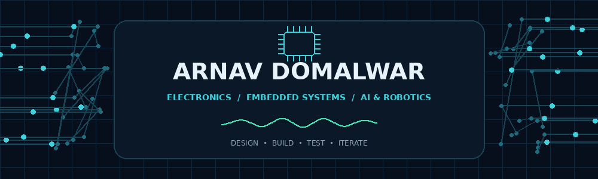
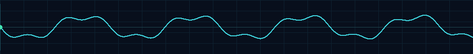

 

---

## Profile

I’m **Arnav Domalwar**, a B.Tech student in **Electronics & Computer Science at Ramdeobaba University, Nagpur**. I enjoy building practical systems at the intersection of electronics and software—from microcontroller-based prototypes and sensor integration to robotics, computer vision, and web applications.

- **Embedded systems:** ESP32, Arduino, Embedded C, sensor interfacing, I²C and UART
- **Robotics:** IR sensing, calibration, motor control, line-following logic
- **AI / computer vision:** Python, OpenCV, PyTorch/TensorFlow workflows, transfer learning
- **Software:** C/C++, Java, JavaScript, React, Node.js, Django, SQL
- **Engineering design:** SolidWorks, CAD, and product-concept development

## Technical toolkit

| Area | Technologies and concepts |
|---|---|
| **Embedded & IoT** | ESP32, Arduino, Embedded C, I²C, UART, sensor interfacing and calibration |
| **Robotics** | 8-channel IR arrays, TB6612FNG, motor control, line tracking |
| **AI / ML** | Python, OpenCV, PyTorch, TensorFlow, transfer learning, model evaluation |
| **Software development** | C, C++, Java, JavaScript, SQL, React, Node.js, Express, Django, REST APIs |
| **Data & engineering** | NumPy, Pandas, Matplotlib, MATLAB, Power BI fundamentals |
| **Tools & design** | Git, GitHub, Linux basics, VS Code, Arduino IDE, SolidWorks, CAD, Blender |

---

## Selected projects

<table>
<tr>
<td width="50%" valign="top">

### 01 / IoT Health Monitoring System

**ESP32 · Arduino · Sensor Integration**

A multi-sensor prototype for acquiring and displaying health-related measurements.

- MAX30100 pulse / SpO₂ sensor
- AD8232 ECG sensor
- DS18B20 temperature sensor
- ADXL345 motion sensor
- HX711 load-cell interface
- Embedded data acquisition and display output

**Focus:** firmware, sensor integration, communication interfaces, and debugging.

</td>
<td width="50%" valign="top">

### 02 / ESP32 Line Follower Bot

**Embedded Systems · Robotics**

An autonomous robot prototype using IR sensing and motor-control logic to follow a line.

- ESP32 microcontroller
- 8-channel IR sensor array
- TB6612FNG motor driver
- N20 geared DC motors
- Calibration and direction handling

**Focus:** real-time sensing, decision logic, and actuator control.

</td>
</tr>
<tr>
<td width="50%" valign="top">

### 03 / Plant Species Classification

**Python · OpenCV · Deep Learning**

An image-classification workflow using leaf images and transfer-learning techniques.

- Dataset preparation and augmentation
- Image preprocessing with OpenCV
- PyTorch / TensorFlow workflow
- Accuracy, F1-score, and confusion-matrix evaluation

**Focus:** training and evaluating a computer-vision pipeline.

</td>
<td width="50%" valign="top">

### 04 / Smart Clip-On Emission Neutralizer

**SolidWorks · CAD · Product Design**

A detachable exhaust-end device concept intended to address vehicular air and noise pollution.

- CAD-based product concept
- Compact, detachable form factor
- Engineering-led environmental problem solving

*Design concept; emissions-reduction performance has not been independently verified.*

</td>
</tr>
</table>

**Additional registered design:** Clip-On Hybrid Conversion Module — a scooter-related hybrid-conversion design concept.

## Milestones

- **HACKSAGON 2025 — Finalist**, ABV-IIITM Gwalior, with an IoT-enabled healthcare project.
- **TECHNOXIAN WORLD CUP 2025 — Participant**, Fastest Line Follower Challenge with Team AutopilotX.
- **TECHSPRINT HACKATHON — Participant**, Google Developer Groups on Campus, RBU.
- **Registered design:** Neutralizer Device for Reduction in Vehicular Air and Noise Pollution.
- **Registered design:** Clip-On Hybrid Conversion Module.

## Current learning direction

- Improving embedded programming, sensor calibration, and hardware–software integration.
- Building stronger AI/ML and computer-vision workflows.
- Practising full-stack development and API integration.
- Strengthening DSA, computer networks, and software engineering fundamentals.

## GitHub activity

<!-- Replace YOUR_GITHUB_USERNAME with your exact GitHub username. -->

## Connect

Interested in embedded systems, IoT, robotics, AI/ML, and collaborative engineering projects.

