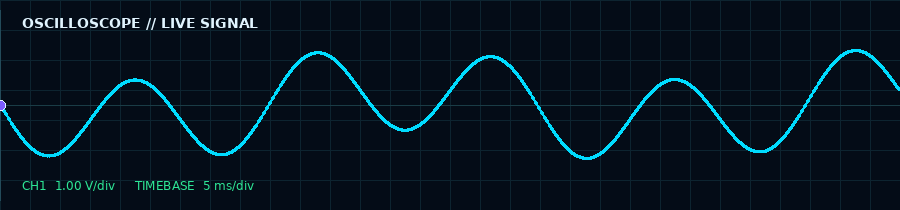
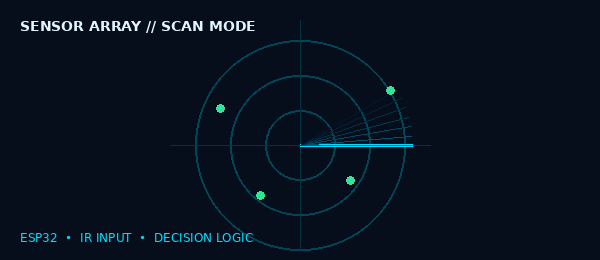
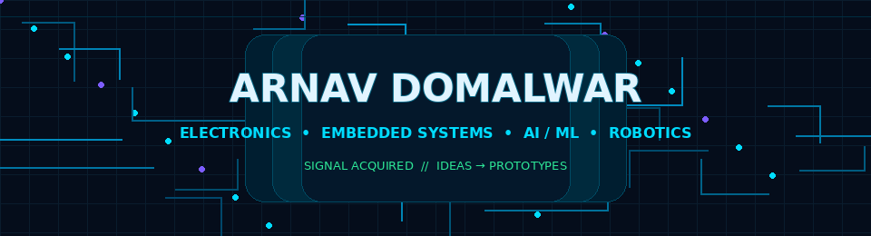

<div align="center">

<div align="center">

<!-- ══════════════════════════════════════════════════════════════════════ -->
<!-- DYNAMIC HEADER & TYPING ANIMATION -->
<!-- ══════════════════════════════════════════════════════════════════════ -->


<a href="https://github.com/arnavdomalwar971">
  
</a>

<br>

<!-- PROFILE VIEWS BADGE -->


<!-- NEON DIVIDER -->
<div align="center">
  
</div>

<!-- ══════════════════════════════════════════════════════════════════════ -->
<!-- TERMINAL STYLE ABOUT ME -->
<!-- ══════════════════════════════════════════════════════════════════════ -->

<div align="center">
  <h2> <code>sys.get_profile()</code></h2>
</div>

```json
{
  "developer": "Arnav Domalwar",
  "location": "Nagpur, Maharashtra, India",
  "education": "B.Tech Electronics & Computer Science @ Ramdeobaba University",
  "status": "Finalist @ HACKSAGON 2025 | Holder of 2 Registered Designs",
  "core_competencies": [
    "AI / Machine Learning",
    "Embedded Systems / IoT",[cite: 2]
    "Computer Vision / Robotics",[cite: 2]
    "Full Stack Web Development"[cite: 2]
  ],
  "mission": "Deploying scalable AI models onto edge hardware and intelligent IoT systems."
}
```


</div>

---

## `boot_sequence()`

```text
[ OK ]  Initializing engineer profile...
[ OK ]  Loading Electronics & Computer Science modules
[ OK ]  Embedded systems interface ........ READY
[ OK ]  AI / ML experimentation ........... ACTIVE
[ OK ]  Robotics + hardware integration ... IN PROGRESS
```

I'm **Arnav Domalwar**, a B.Tech Electronics & Computer Science student at **Ramdeobaba University, Nagpur**. I like working where hardware and software meet: interfacing sensors, programming microcontrollers, building robotic prototypes, and exploring AI-powered systems.

<div align="center">



</div>

## `engineering_stack()`

<div align="center">

| Domain | Tools and concepts |
|---|---|
| **Embedded & electronics** | ESP32, Arduino, Embedded C, I²C, UART, sensor interfacing, calibration |
| **Robotics** | IR sensor arrays, TB6612FNG motor driver, motor control, line tracking |
| **AI / ML & vision** | Python, OpenCV, PyTorch, TensorFlow, transfer learning, model evaluation |
| **Programming** | C, C++, Java, Python, JavaScript, SQL |
| **Web development** | HTML, CSS, React, Node.js, Express, Django, REST APIs |
| **Data & engineering** | NumPy, Pandas, Matplotlib, MATLAB, Power BI fundamentals |
| **Tools & design** | Git, GitHub, Linux basics, VS Code, Arduino IDE, SolidWorks, CAD, Blender |

</div>

<div align="center">

</div>

---

## `featured_projects()`

<table>
<tr>
<td width="50%" valign="top">

### ❤️ IoT Health Monitoring System


Multi-sensor health-monitoring prototype using ESP32 and Arduino.

- MAX30100 pulse / SpO₂ sensor
- AD8232 ECG sensor
- DS18B20 temperature sensor
- ADXL345 motion sensor
- HX711 load-cell interface
- I²C data acquisition and display output

**Focus:** sensor integration, firmware, data acquisition, and debugging.

</td>
<td width="50%" valign="top">

### 🤖 ESP32 Line Follower Bot


Autonomous line-following robot built around real-time sensing and motor control.

- ESP32 microcontroller
- 8-channel IR sensor array
- TB6612FNG motor driver
- N20 geared DC motors
- Sensor calibration and direction logic

**Focus:** sensing → decision logic → motor actuation.

</td>
</tr>
<tr>
<td width="50%" valign="top">

### 🌿 Plant Species Classification


Leaf-image classification workflow using computer-vision preprocessing and transfer learning.

- Dataset preparation and augmentation
- OpenCV preprocessing
- PyTorch / TensorFlow workflow
- Accuracy, F1-score, confusion matrix

**Focus:** model training and evaluation.

</td>
<td width="50%" valign="top">

### 🌫️ Smart Clip-On Emission Neutralizer


CAD concept for a detachable exhaust-end device intended to help reduce vehicular air and noise pollution.

- SolidWorks and CAD workflow
- Compact detachable form factor
- Environmental problem-solving concept

**Note:** a design concept, not a claim of independently verified reduction performance.

</td>
</tr>
</table>

<div align="center">



</div>

### Additional registered design

**Clip-On Hybrid Conversion Module** — a scooter-related hybrid-conversion design concept.

---

## `milestones()`

- 🏁 **HACKSAGON 2025 finalist** — ABV-IIITM Gwalior; IoT-enabled healthcare project.
- 🏎️ **TECHNOXIAN WORLD CUP 2025 participant** — Fastest Line Follower Challenge with Team AutopilotX.
- 💡 **TECHSPRINT HACKATHON participant** — Google Developer Groups on Campus, RBU.
- 📐 **Registered design:** Neutralizer Device for Reduction in Vehicular Air and Noise Pollution.
- 📐 **Registered design:** Clip-On Hybrid Conversion Module.

---

## `in_the_lab()`

```text
          PHYSICAL WORLD
                │
                ▼
      ┌──────────────────┐
      │ SENSORS / INPUTS │  IR • I²C • UART
      └────────┬─────────┘
               ▼
      ┌──────────────────┐
      │ ESP32 / MCU      │  Read • Filter • Decide
      └────────┬─────────┘
               ▼
      ┌──────────────────┐
      │ OUTPUT / ACTION  │  Motors • Display • Data
      └──────────────────┘
```

Currently strengthening my embedded programming, sensor calibration, machine-learning workflows, web development, and core computer-science fundamentals.

## `github_dashboard()`

<div align="center">

<!-- Replace YOUR_GITHUB_USERNAME with your exact GitHub username -->


</div>

## `connect()`

<div align="center">

<a href="mailto:arnavdomalwar971@gmail.com"></a>
<a href="https://github.com/"></a>
<a href="https://www.linkedin.com/"></a>


</div>

<div align="center">



</div>
